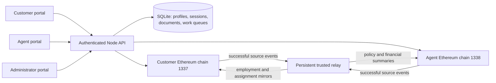

# Architecture and design

## Scope and authority

PolicyGuard is an academic, hybrid-storage Ethereum application for one fictional insurer, Sahana Life. It demonstrates a coherent insurance-policy lifecycle and revocation of a former agent's application access. Two local development chains run in the Node process; neither exposes a public HTTP RPC listener.

| Record | Authoritative location | Mirror / read model |
|---|---|---|
| Issued policy terms, premiums, balance, cancellation, maturity settlement | Customer chain 1337 | Policy summaries on agent chain 1338 |
| Agent approval, departure and current customer assignment | Agent chain 1338 | Employment and servicing assignment on customer chain 1337 |
| Username, password hash, profile and contact details | SQLite | Never written to contracts |
| Exact policy document | SQLite | SHA-256 fingerprint in the issued customer-chain policy |
| Operation and relay progress, notifications | SQLite | Linked to source and destination transactions |

Each chain has its own Ganache database and configured chain ID. Normal startup uses a two-second development mining interval, including empty blocks. The application uses Solidity 0.8.30 compiled for the Shanghai EVM and ethers 6.15.0. The local development miner is not a distributed validator network.

Identify a deployment by its **chain ID and contract address together**. Address strings can match on the two chains; their databases, contracts, state and transaction histories are still separate.

## Contract rules

`CustomerLedger` is the financial authority. A customer's first registration grants 50,000,000 paise once. Policies store their plan identity, fixed premium, number of instalments, bonus, issue timestamp, original onboarding agent and document fingerprint. Version 1 is bound into the exact fingerprinted terms; the fixed catalogue is part of this deployment's contract source. There is no contract upgrade or terms editor. Separate lifecycle fields/events record instalments, closure, fee and refund.

Purchasing debits the first instalment. Each later payment names its expected instalment number. The contract rejects stale numbers, insufficient balance, closed policies and payments beyond the plan count. At `issuedAt + years × 365 days`, early cancellation becomes unavailable; full payment is required for one-time maturity settlement. Before that boundary, fee is `premiumsPaid / 10`, refund is `premiumsPaid - fee`, and no bonus is returned. All preset plan amounts divide exactly into integer paise for the fee calculation.

`AgentLedger` is the employment and assignment authority. Only the designated insurer administrator can approve or reject an undecided applicant. The agent's own account can resign while employed. It cannot reinstate itself, change financial terms or assign customers. Replacements are selected by lowest assigned-customer count, then lowest agent ID. Existing customers retain their employed agent for further purchases. Customers with no replacement are assigned when an eligible agent is approved. Customer-level servicing applies to the customer's portfolio; closed policy records and onboarding identities remain unchanged.

Contracts keep replay identifiers for source operations and mirrored events. Only the designated relay address may call mirror methods. User signers cannot directly impersonate either privileged address.

## Authentication and the local signer model

Passwords use a random per-password salt and scrypt (`N=32768`, `r=8`, `p=1`). Cookies contain random session tokens; only token digests are stored. Sessions last eight hours and use HttpOnly and SameSite=Strict. Protected writes need a session CSRF token and a same-origin application header; incoming host/origin checks, JSON limits and login throttling add request boundaries. The normal HTTP server binds only to loopback; HTTPS, public hosting and account recovery are outside this local version.

Each user has a separate random Ethereum key. Wallet keys are encrypted in SQLite with AES-256-GCM using `data/secret.key`. The deployment administrator and relay also have separate keys. The API derives the user and signer from the server-side session, never a submitted user ID or role. Administrative registration/approval transactions use the contract's designated administrator key after an authenticated application administrator's permission check.

Local test accounts receive a development-only ETH gas allowance using Ganache's account-balance utility. This is independent of the INR ledger: premiums and refunds move contract test credit, not ETH. The application is custodial: machine administrators can read its files and control its signers. Encryption here is useful separation at rest, not protection from an administrator with both the database and its key file.

## Resignation and privacy

Every sensitive agent endpoint checks current employment on **chain 1338**, including plans, customer portfolios, finance, notifications and explorer access. An additional check immediately before response protects in-flight sensitive requests. If verification fails, the response contains no customer data. The agent's own account/status/history and own resignation operation remain accessible.

Newly approved agents remain pending for portal access while the positive employment update is synchronising to chain 1337. Revocation takes effect immediately from chain 1338 even if that mirror is delayed. This avoids granting privileges before approval synchronisation while never delaying removal of privileges.

A confirmed resignation emits an access-change signal to open sessions. The browser removes cached dashboard, policy, plan, notification, explorer and dialog contents and re-fetches permitted views. Polling and history-restoration checks provide additional refresh paths; an unverified employment record hides customer data. Login changes between tabs clear the previous account's state. This is access revocation within the application. It cannot destroy screenshots or data saved previously, and an operator with filesystem/RPC control is outside this portal security boundary.

The explorer contains blockchain addresses and amounts, not names or contacts. Addresses and financial events are pseudonymous, not anonymous. Authorised portfolio views enrich them with permitted profile data; general explorer results do not. Since customers and employed agents can inspect chain records, the financial chain is not confidential to one individual policyholder.

## Durable synchronisation and recovery

1. A permitted action is saved as an operation in SQLite with its authenticated owner, input and idempotency request key. The API returns an operation ID.
2. The worker populates and signs a transaction, then persists its exact raw bytes and hash **before broadcast**. On retry it checks the receipt and reuses those bytes.
3. A successful mined source event is indexed with a key derived from `chain ID + contract address + transaction hash + log index`. Chain cursors and the corresponding event/jobs are committed together in SQLite.
4. Policy issuance, premium and closure events travel customer → agent. Employment and servicing-assignment events travel agent → customer. Mirror acknowledgements do not create relay jobs. A purchase mirror can produce a real assignment event, which is relayed back once.
5. Jobs are processed in source-chain block/log order. The destination contract rejects repeated application of an event key. Destination signed bytes, transaction hash, errors and attempt counts are persistent.
6. Idempotent notification inserts use a unique `(user, event, kind)` constraint. The job becomes synchronised only after the destination and notification work completes.
7. The operation finishes when its related relay jobs, including resulting assignment events, finish. A destination failure leaves the confirmed source transaction intact. Background retries or administrator attention complete the missing work.

**Pending** means waiting for source processing. **Synchronising** means the source is confirmed but some cross-chain work is unfinished. **Synchronised** means the related recorded deliveries completed. **Needs attention** includes a rejected source action or a delivery failure. No UI state promises atomic updates across chains.

These chains treat inclusion in one successfully mined block as confirmation. There is no public-network reorganisation/finality protocol. Source cursors moving backwards are an error. On restart the server checks the saved deployment/source fingerprint, both chain directories, genesis identifiers and deployed code presence. It resumes queues and checks stored signed transactions before retrying. Missing/inconsistent storage stops startup; the operator must restore a complete matching backup. This is not a general disaster-recovery or corrupted-database repair system.

## Explorer and integrity checks

Block headers and transaction/receipt data come from Ethereum RPC rather than fabricated arrays. The explorer includes real number, hash, parent hash, timestamp, roots, transaction count and gas values. Next-block navigation fetches block `n + 1` and verifies its parent hash. It cannot infer a stored next pointer because Ethereum blocks do not contain one.

The range check verifies consecutive block numbering, parent hashes, nondecreasing timestamps and each transaction's receipt membership: transaction hash, transaction index, block number and block hash. Tests deliberately alter parent hashes and receipt indices to confirm detection. It does **not** independently recompute header hashes, state tries or consensus validity; it trusts the local RPC's recorded data. The UI labels this boundary.

Reference: [Ethereum block structure](https://ethereum.org/en/developers/docs/blocks/) and [Ethereum JSON-RPC](https://ethereum.org/en/developers/docs/apis/json-rpc/).

## Manageable design trade-offs

The implementation deliberately uses plain JavaScript, a small HTTP server, two Solidity files and SQLite. No token sale, NFTs, IPFS, microservice platform, external oracle, wallet extension or public network is needed. A trusted relay is simpler to explain and recover than a cryptographic cross-chain proof system.

The contracts reassign waiting customers using loops, and the local worker serialises transactions to avoid nonce conflicts. These choices fit a classroom-sized dataset; they are not designed for an insurer with millions of customers. Production work would require bounded/batched reassignment, a stronger key-custody model, independent security review, monitoring, operational backup procedures and a justified network/governance design. These are beyond the agreed academic milestone.
